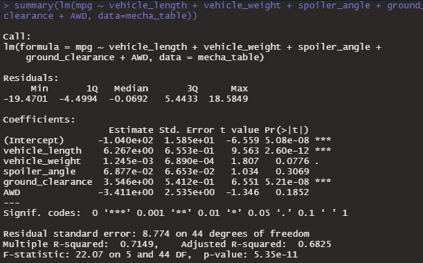
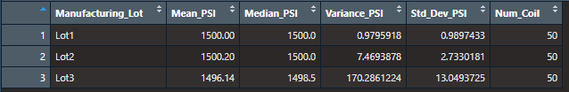
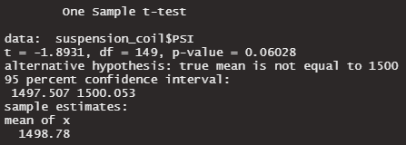
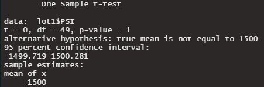
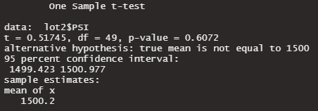
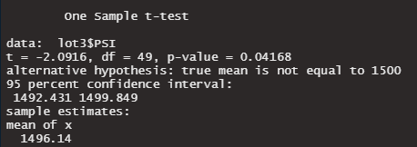

# MechaCar_Statistical_Analysis-

# Overview of Project

A few weeks after starting his new role, Jeremy is approached by upper management about a special project. AutosRUs’ newest prototype, the MechaCar, is suffering from production troubles that are blocking the manufacturing team’s progress. AutosRUs’ upper management has called on Jeremy and the data analytics team to review the production data for insights that may help the manufacturing team.

In this challenge, you’ll help Jeremy and the data analytics team do the following:

- Perform multiple linear regression analysis to identify which variables in the dataset predict the mpg of MechaCar prototypes
- Collect summary statistics on the pounds per square inch (PSI) of the suspension coils from the manufacturing lots
- Run t-tests to determine if the manufacturing lots are statistically different from the mean population
- Design a statistical study to compare vehicle performance of the MechaCar vehicles against vehicles from other manufacturers. For each statistical analysis, you’ll write a summary interpretation of the findings.

# Resources

- Data Source: MechaCar_mpg.csv and Suspension_Coil.csv

- Data Tools: tidyverse, dplyr and MechaCarChallenge.RScript.

- Software: RStudio and R

## Deliverables

### Linear Regression to Predict MPG

### Results:

mpg = (6.267)vehicle_length + (0.0012)vehicle_weight + (0.0688)spoiler_angle + (3.546)ground_clearance + (-3.411)AWD + (-104.0)

Statistical Summary:

1. Approximately 71% of all mpg predictions will be determined by this model since the linear model has an r-squared value of 0.7149.

2. The p-Value (5.35e-11) for this model is lesser than the presumed significance level of 0.05% hence sufficient evidence to reject our null hypothesis.

3. The vehicle length and vehicle ground clearance have a significant impact on miles per gallon on the MechaCar prototype. In addition, the vehicle weight, spoiler angle, and All Wheel Drive have p-Values that indicate a random amount of variance with the dataset.

### Summary Statistics on Suspension Coils

### Technical Analysis

- Write an RScript that creates a total_summary dataframe using the summarize() function to get the mean, median, variance, and standard deviation of the suspension coil’s PSI column. The dataframe:

- Write an RScript that creates a lot_summary dataframe using the group_by() and the summarize() functions to group each manufacturing lot by the mean, median, variance, and standard deviation of the suspension coil’s PSI column. The lot_summary dataframe:

### t-Tests on Suspension Coils

Requirements: Using your knowledge of R, perform t-tests to determine if all manufacturing lots and each lot individually are statistically different from the population mean of 1,500 pounds per square inch.

Technical Analysis

1. In your MechaCarChallenge.RScript, write an RScript using the t.test() function to determine if the PSI across all manufacturing lots is statistically different from the population mean of 1,500 pounds per square inch.

2. Write three more RScripts in your MechaCarChallenge.RScript using the t.test() function and its subset() argument to determine if the PSI for each manufacturing lot is statistically different from the population mean of 1,500 pounds per square inch.

Below is the summary of the t- Test

### Design a Study Comparing the MechaCar to the Competition

The statistical study design has the following:

- A metric to be tested is mentioned

- A null hypothesis or an alternative hypothesis is described

- A statistical test is described to test the hypothesis

This study would involve collecting data on MechaCar and its comparable models across several different manufacturers over the last 3 years.

- What are the competitions' comparable models,

- Which cars will MechaCar be competing with head-to-head? which cars will be included in the study?

- Which factors will look at the study to determine the relevant to selling price?

Metrics

Collecting data for comparable models for the past three years:

- Average cost of maintenance

- Current Price marked selling price

- Engine (Electric, Hybrid, Gasoline / Conventional): Independent Variable

- Resale Value: Independent Variable

## Hypothesis: Null and Alternative

After determining which factors are key for the MechaCar's genre:

- Null Hypothesis (Ho): Based on its performance of key factors MechaCar is well priced 

- Alternative Hypothesis (Ha): MechaCar is not priced correctly based on performance of key factors.

## Statistical Tests

Multiple linear regression would be used to determine the factors that have the highest predictability with the list selling price (dependent variable); which combination has the greatest impact on price.
